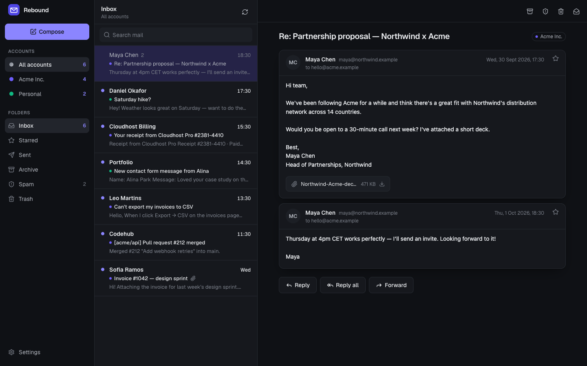
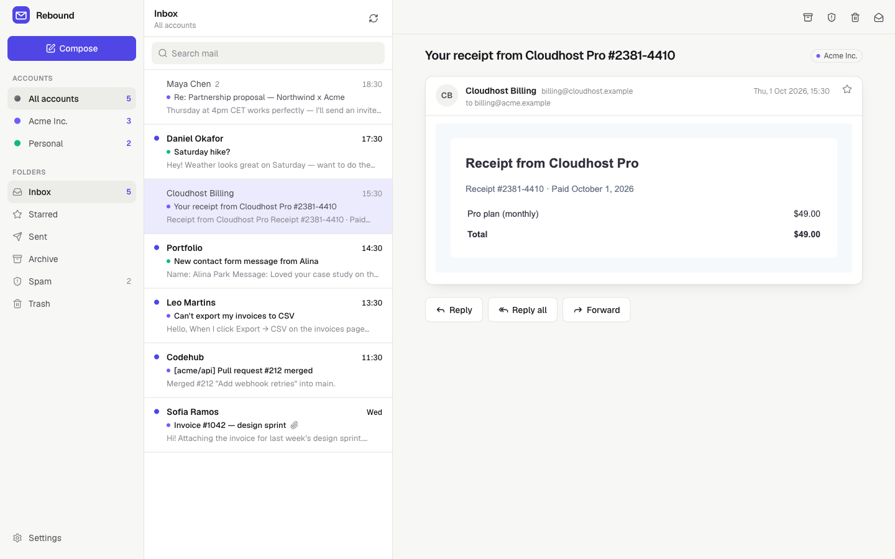
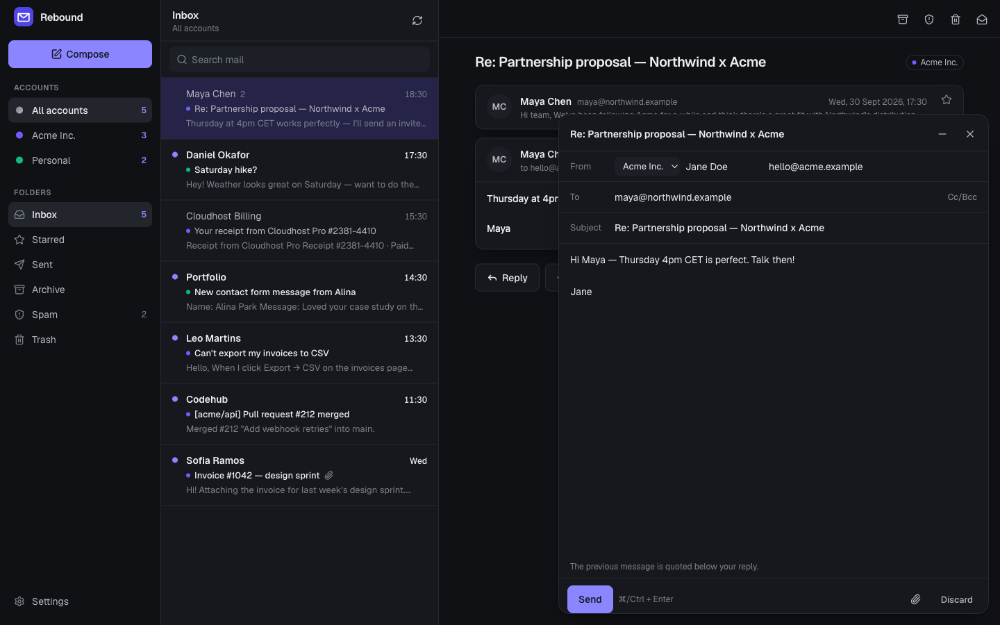
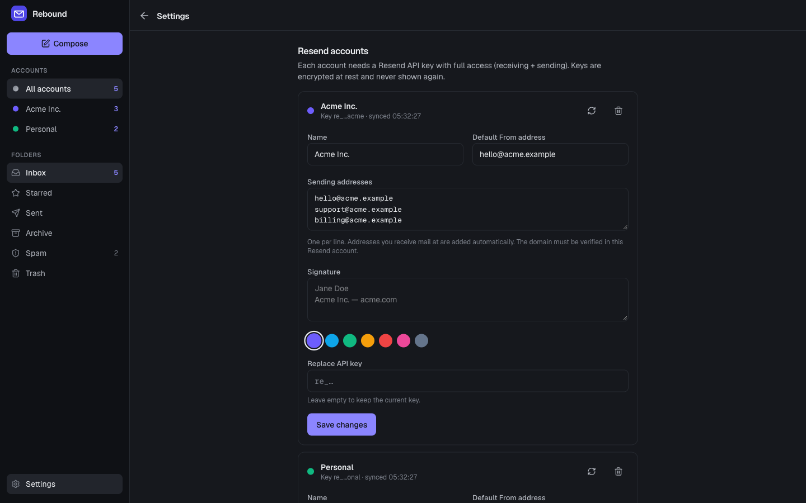
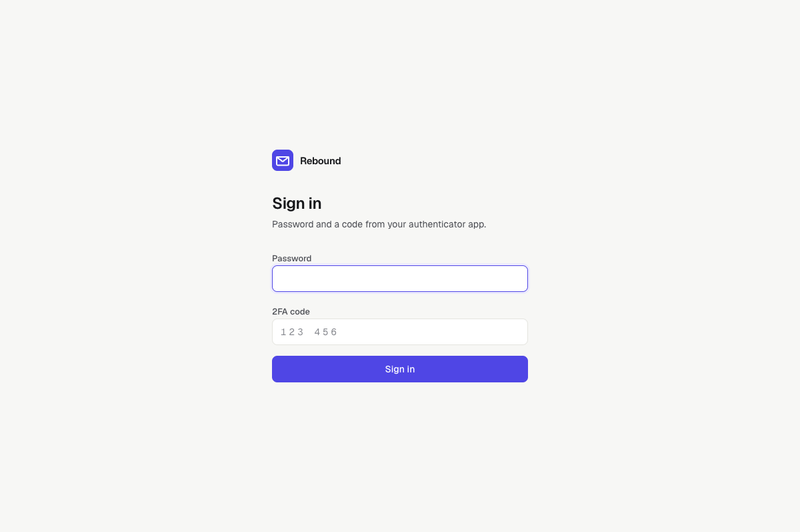
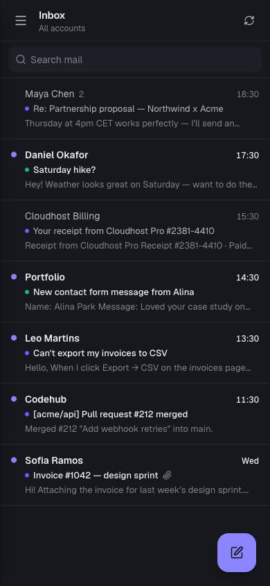
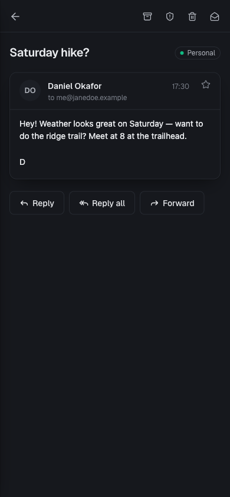

<div align="center">


# Rebound

**A self-hosted, multi-account inbox for [Resend](https://resend.com).**
Read, reply and send from every Resend account you own — on desktop and on your phone, with push notifications.

[](https://github.com/vrlda/rebound/actions/workflows/ci.yml)
[](https://github.com/vrlda/rebound/pkgs/container/rebound)
[](LICENSE)



</div>

---

Resend is great for sending email and can receive it too — but the dashboard isn't an email client: no notifications, no replies, no threads. **Rebound turns your Resend receiving into a real inbox** that you host yourself.

Rebound started as the in-house inbox for [Vulta](https://vulta.one), a non-custodial card and crypto payment platform, and was open-sourced from there.

## Features

- **Every Resend account in one inbox** — connect as many accounts as you like (your company, side projects, clients), each with its own color, sending addresses and signature.
- **Reply, reply all, forward, compose** — choose which address to send from; replies thread correctly in Gmail, Outlook & co. (`In-Reply-To` / `References`).
- **Conversations** — messages are grouped into threads, with attachments, stars, archive, spam and trash.
- **Push notifications** on desktop and phone (installable PWA — *Add to Home Screen* on iOS/Android).
- **Spam filtering** — Resend/SES spam & virus verdicts, a phrase filter, repeat-spammer detection, and your own block/allow rules.
- **Private by default** — remote images are blocked until you load them, email HTML is rendered without scripts, links open without a referrer.
- **Secure** — single user, password + **mandatory 2FA (TOTP)**, encrypted API keys, rate-limited login. See [SECURITY.md](SECURITY.md).
- **Your mail stays** — messages and attachments are stored locally, so they outlive Resend's receiving retention.
- **Light & dark**, keyboard shortcuts (`c` compose, `r` reply, `e` archive, `#` trash, `j`/`k` navigate, `/` search).
- **Tiny** — one Go binary with SQLite and the web app embedded; ~20 MB image, no external database.

## Screenshots

| Light mode, rich HTML email | Composer |
|---|---|
|  |  |
| **Multiple Resend accounts** | **2FA sign-in** |
|  |  |

<p align="center">
  
  &nbsp;&nbsp;
  
</p>

## Quick start

You need a server with Docker and a domain (e.g. `mail.example.com`) whose DNS points at it.

### One command

```bash
curl -fsSL https://raw.githubusercontent.com/vrlda/rebound/main/install.sh | sh -s -- mail.example.com
```

This downloads the compose file, starts Rebound behind [Caddy](https://caddyserver.com) (automatic HTTPS), and prints your **one-time setup link**.

### Or with Docker Compose

```bash
git clone https://github.com/vrlda/rebound.git && cd rebound
cp .env.example .env          # set DOMAIN=mail.example.com
docker compose up -d
docker compose logs rebound | grep "SETUP LINK"
```

### First login

1. Open the setup link, scan the QR code with an authenticator app (1Password, Google Authenticator, Authy…), choose a password.
2. **Settings → Resend accounts → Connect**: paste a Resend API key with **full access** (receiving + sending).
3. Mail appears within a minute. On your phone: open the site → *Share* → *Add to Home Screen* → **Settings → Enable notifications**.

> **Receiving must be enabled in Resend.** Rebound reads mail from Resend's receiving API, so your domain needs Resend inbound set up (MX records pointing to Resend). See [Resend's docs on receiving email](https://resend.com/docs).

## Configuration

All configuration is via environment variables (the compose file sets the important ones).

| Variable | Default | Description |
|---|---|---|
| `PUBLIC_URL` | `http://localhost:8080` | Public URL (used for links, cookies, push). The compose file derives it from `DOMAIN`. |
| `DATA_DIR` | `/data` | Where the SQLite database, attachments and `master.key` live. Mount a volume here. |
| `LISTEN` | `:8080` | Listen address. |
| `BOOTSTRAP_RESEND_KEY` | — | Optional: connect this Resend account on first start (`RESEND_API_KEY` in `.env`). |
| `BOOTSTRAP_ACCOUNT_NAME` | `Default` | Name of the bootstrapped account. |
| `VAPID_SUBJECT` | `mailto:admin@<your host>` | Contact sent to push services. |

## Operations

```bash
# Lost your phone / forgot your password: wipes credentials and prints a new setup link
docker compose exec rebound rebound reset-auth

# Update to the latest version
docker compose pull && docker compose up -d

# Logs
docker compose logs -f rebound
```

**Backups:** back up the `rebound-data` volume. It contains your mail and `master.key` — without that key the stored API keys can't be decrypted (you'd just reconnect your accounts).

## How it works

- Every ~45 seconds Rebound polls each account's Resend **receiving** API, stores new messages and attachments in SQLite, classifies spam, threads conversations and sends push notifications.
- Sending uses Resend's **send** API with your chosen From address (its domain must be verified in that Resend account).
- No webhooks or inbound ports are needed — it works behind any firewall that allows outbound HTTPS.

## Development

```bash
# Web app (React + Vite + Tailwind) → builds into server/dist
cd web && npm install && npx vite build

# Server (Go 1.26+)
cd ../server
go test ./...
DATA_DIR=./data PUBLIC_URL=http://localhost:8080 go run .
```

`RESEND_API_BASE` can point the server at a mock Resend API for local testing. Pull requests are welcome — please run `go test ./...` and `npx tsc --noEmit -p .` first.

## License

[MIT](LICENSE) © 2026 Dan ([@vrlda](https://github.com/vrlda))

*Rebound is an independent project and is not affiliated with or endorsed by Resend.*
